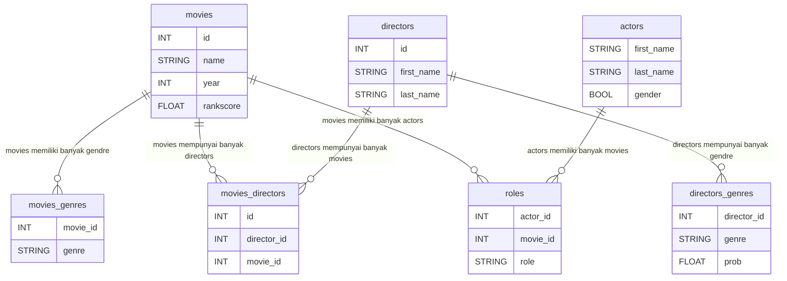

# ERD

```mermaid
erDiagram
movies{
    INT id 
    STRING name 
    INT year 
    FLOAT rankscore 
}

movies_directors{
    INT id 
    INT director_id 
    INT movie_id 
}

directors{
    INT id 
    STRING first_name 
    STRING last_name 
}

directors_genres{
    INT director_id 
    STRING genre 
    FLOAT prob 
}

actors{
 STRING first_name
 STRING last_name
 BOOL gender
}

movies_genres {
    INT movie_id
    STRING genre
}

roles{
    INT actor_id
    INT movie_id
    STRING role
}

directors||--o{movies_directors : "directors mempunyai banyak movies"
movies||--o{movies_directors : "movies mempunyai banyak directors"
directors||--o{directors_genres : "directors mempunyai banyak gendre"
movies||--o{movies_genres : "movies memiliki banyak gendre"
actors||--o{roles : "actors memiliki banyak movies"
movies||--o{roles : "movies memiliki banyak actors"
```